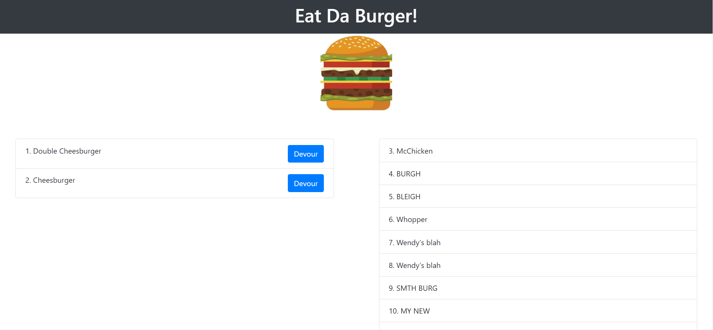

# Eat-Burger

The simple application which allows to add new burgers and "devour" them (change their status).

The application features UI (built with HTML, Bootstrap and custom CSS), server (built with Node Express) and database (mySQL). The application is deployed to Heroku. 

The UI has two lists: non-devoured burgers on the left and history of devoured burgers on the right. The user can add new burger by inputing burger name and clicking "Add burger" button. The burger will then be saved to the database and will show up on the UI in the left list. If the user clicks "Devour" button, the burger will move to the right list (history of devoured burgers).

